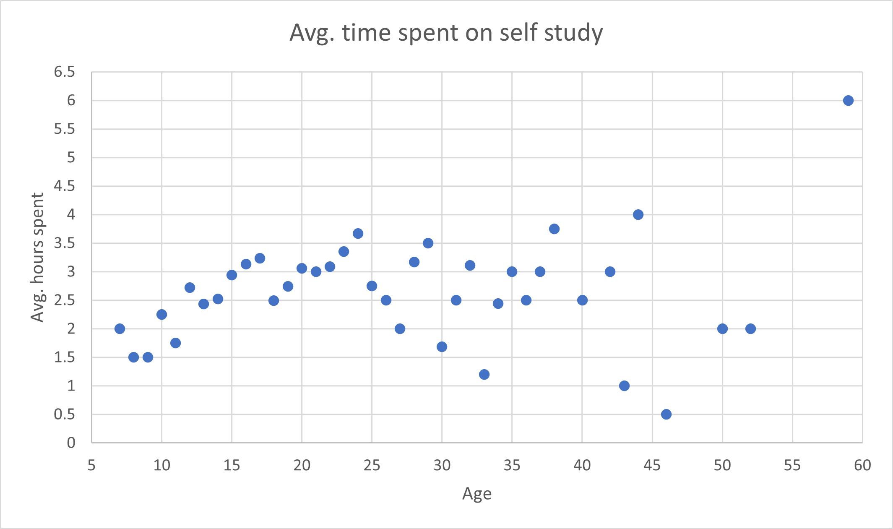
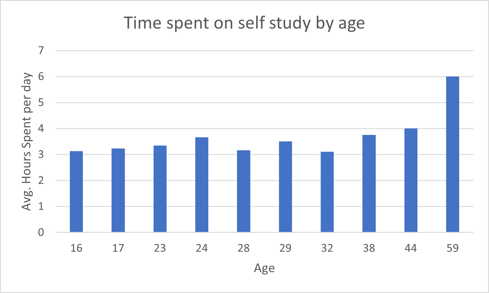

# reddy-map-reduce-student-survey
Basic map reduce using python on student survey responses

## Data
For this map reduce, data of the students survey on COVID-19 and its impact on education, social life and mental health of students is chosen.

This data is taken from the website kaggle and the link is as follows:
[Data link](https://www.kaggle.com/kunal28chaturvedi/covid19-and-its-impact-on-students)

Data is collected from students of different age groups from different educational institutions in Delhi National Capital Region(NCR) which is a survey of 1182 students.

## Question to be answered from this map reduce
Find out the average daily time spent by students self studying based on their age and summarize results.

## Summary of the results
*   The following scattered graph shows the average time spent by   students daily self studing of all the age students.

    

    By seeing the graph , we can predict the following results:
    -   Most of the students studying hours is in between 2-4 hours.
    -   Least hours spent by the students are from age group 46 and 43
    -   Most hours spent by the students are from age group 44 and 59
*   The following bar graph shows the top 10 average time spent in self studying age groups.

    

    From the above agraph we can infer that age groups greater than 24 are more in the top 10 compared to age groups less than 24 which is quite surprising.

## Execution Instructions
-   Once the project is cloned, open powershell as administration in the root folder of the project.
-   You should find the input .csv file with the name "Survey_Student.csv".
-   We use this file as an input to the mapper python file as follows:
    ```
    cat Survey_Student.csv | Python 02mapper.py
    ```
-   The mapped data need to be sorted before reducing it, we execute the following command:
    ```
    cat Survey_Student.csv | Python 02mapper.py | sort
    ```
-   The sorted file is then reduced with the following command:
    ```
    cat Survey_Student.csv | Python 02mapper.py | sort | Python 02reducer.py
    ```
-   We can append the reduced data to a new file with command "> reddy_output.txt"

We can do all the above tasks with a single chaining of commands as follows:
```
cat Survey_Student.csv | Python 02mapper.py | sort | Python 02reducer.py > reddy_output.txt
```


